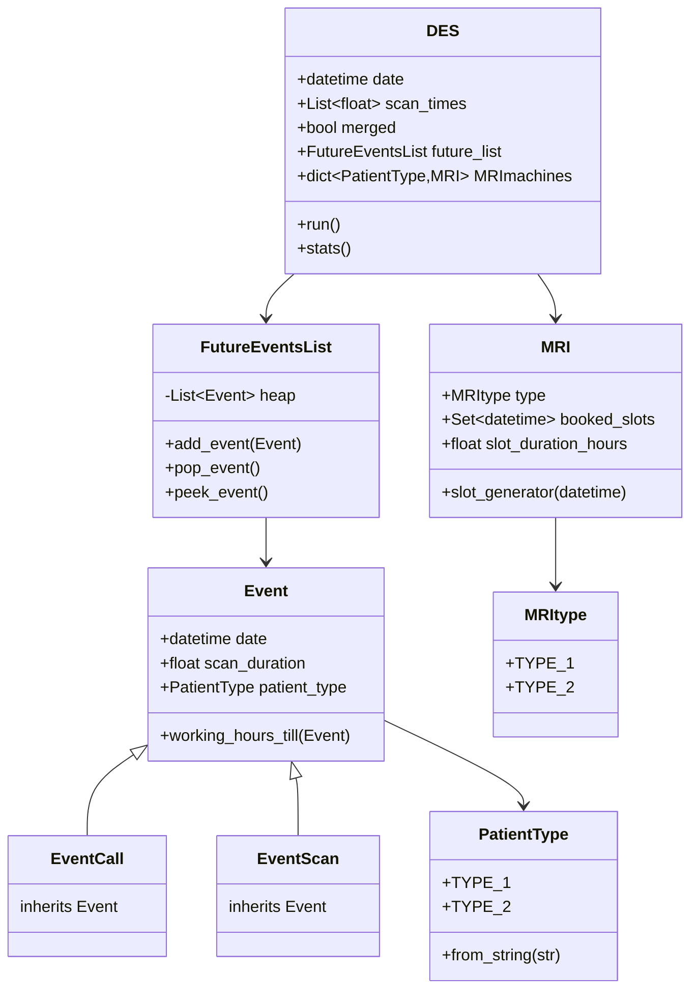

# Computational-Assignment

This project consists of two main parts:
1. Econometrics Part - Statistical analysis of patient data
2. Operations Research Part - A discrete event simulator for MRI scheduling


## Operations Research Part Structure



### Key Components

#### Models
- **Event** (`models/event.py`): Base class for simulation events
  - `EventCall`: Patient appointment request events
  - `EventScan`: MRI scanning events
  - Handles working hours calculations and event ordering

- **MRI** (`models/mri.py`): MRI machine management
  - `MRItype`: Enum for machine types
  - Handles slot scheduling and availability
  - Manages booked time slots

- **PatientType** (`models/patient.py`): Patient classification
  - Enum for different patient types
  - Handles conversion from string representations

#### Services
- **FutureEventsList** (`services/event_list.py`): Event queue management
  - Priority queue implementation for events
  - Maintains chronological event ordering

- **DES** (`services/simulator.py`): Discrete Event Simulator
  - Main simulation logic
  - Handles event processing
  - Collects and reports statistics

#### Utils
- **FileReader** (`utils/file_reader.py`): Data input handling
  - Parses CSV records
  - Creates initial event list
  - Validates input data

### Usage

The simulation can be configured and run through `main.py`.

```python
from services.simulator import DES
from pathlib import Path

# Create and configure the Discrete Event Simulator
sim = DES(
    filePath=Path("scanrecords.csv"),  # Path to input data
    scan_times=[0.8, 1.2],            # Scan durations [Type1, Type2]
    merged=False,                      # Machine allocation strategy
)

# Run simulation and get statistics
sim.run()
sim.stats()
```

#### Configuration Options

1. **Input File** (`filePath`): 
   - CSV file containing patient records
   - Format: `date,time,duration,patient_type`
   - Example: `2024-01-01,8.5,1.2,"Type 2"`

2. **Scan Times** (`scan_times`): 
   - List of scan durations for each patient type
   - `[Type1_duration, Type2_duration]`
   - Units: hours
   - Example: `[0.8, 1.2]` means:
     - Type 1 patients: 0.8 hours (48 minutes)
     - Type 2 patients: 1.2 hours (72 minutes)

3. **Machine Strategy** (`merged`):
   - `True`: All MRI machines can handle all patient types
   - `False`: Dedicated machines per patient type
   - Affects how patients are assigned to machines

#### Running the Simulation

1. Prepare your input CSV file
2. Configure the simulation parameters
3. Run using:
```bash
python -m operations_research_part.main
```

The simulation will output statistics including:
- Average waiting times
- Maximum waiting time
- Number of patients served
- Machine utilization rates


