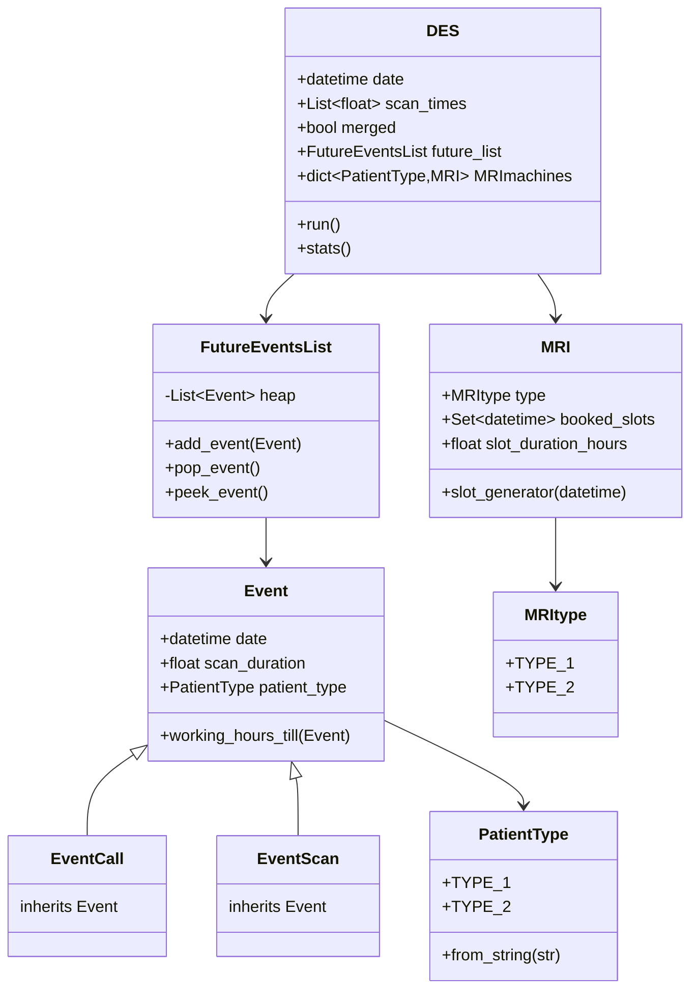

# Computational-Assignment

This project consists of two main parts:
1. Econometrics Part - Statistical analysis of patient data
2. Operations Research Part - A discrete event simulator for MRI scheduling

## Operations Research Part Structure

### Key Components

- **Event System**
  - `Event`: Base class for all events
  - `EventCall`: Represents a patient calling to schedule
  - `EventScan`: Represents the actual scanning appointment

- **MRI Management**
  - `MRI`: Handles individual MRI machine scheduling
  - `MRItype`: Defines different types of MRI machines

- **Scheduling**
  - `FutureEventsList`: Priority queue for event management
  - `DES`: Main discrete event simulator

### Usage

To run the simulation, use the `main()` function in `main.py`.

