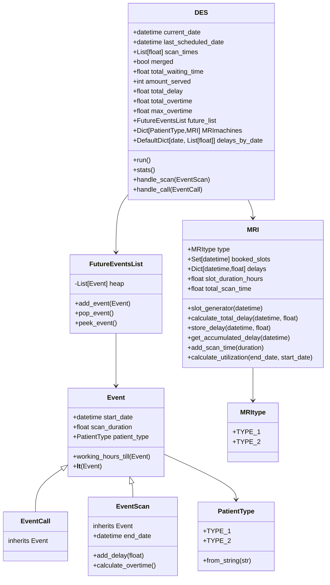

# Computational-Assignment

This project consists of two main parts:
1. Econometrics Part - Statistical analysis of patient data
2. Operations Research Part - A discrete event simulator for MRI scheduling

## Operations Research Part Structure



### Key Components

#### Models
- **Event** (`models/event.py`): Base class for simulation events
  - `EventCall`: Patient appointment request events
  - `EventScan`: MRI scanning events with end time tracking and delay management
  - Handles working hours calculations and event ordering

- **MRI** (`models/mri.py`): MRI machine management
  - `MRItype`: Enum for machine types
  - Handles slot scheduling and availability
  - Manages delays and their accumulation throughout the day

- **PatientType** (`models/patient.py`): Patient classification
  - Enum for different patient types
  - Handles conversion from string representations

#### Services
- **FutureEventsList** (`services/event_list.py`): Event queue management
  - Priority queue implementation for events
  - Maintains chronological event ordering

- **DES** (`services/simulator.py`): Discrete Event Simulator
  - Main simulation logic
  - Handles event processing
  - Collects and reports statistics

#### Utils
- **FileReader** (`utils/file_reader.py`): Data input handling
  - Parses CSV records
  - Creates initial event list
  - Validates input data

### Simulation Parameters

#### Operating Hours
- Working hours: 8:00 - 17:00
- Weekdays only (Monday-Friday)
- Overtime is tracked when scans extend beyond 17:00

#### Configuration Options
1. **Input File** (`filePath`): 
   - CSV file containing patient records
   - Format: `date,time,duration,patient_type`
   - Example: `2024-01-01,8.5,1.2,"Type 2"`

2. **Scan Times** (`scan_times`): 
   - List of scan durations for each patient type
   - `[Type1_duration, Type2_duration]`
   - Units: hours
   - Example: `[0.8, 1.2]` means:
     - Type 1 patients: 0.8 hours (48 minutes)
     - Type 2 patients: 1.2 hours (72 minutes)

3. **Machine Strategy** (`merged`):
   - `True`: All MRI machines can handle all patient types
   - `False`: Dedicated machines per patient type
   - Affects how patients are assigned to machines

### Running the Simulation

1. Prepare your input CSV file
2. Configure the simulation parameters
3. Run using:
```bash
python -m operations_research_part.main
```

### Output Statistics

1. **Timing Statistics**
   - Average waiting time in operational hours
   - Maximum waiting time in operational hours
   - Last scheduled scan date and time
   - Last finished scan date and time

2. **Efficiency Metrics**
   - Total overtime used
   - Maximum overtime in a day
   - MRI utilization rates per machine type

3. **Delay Analysis**
   - Average delay per customer
   - Average total delay per day
   - Average delay per scan

### Data Generation

The project includes scripts for generating synthetic patient data:
- `econometrics part/Statistical Analysis Type 1.ipynb`: Generates Type 1 patient data
- `econometrics part/generate data type2.py`: Generates Type 2 patient data
- `econometrics part/merge_generated.py`: Merges both patient types into a single dataset

### Statistical Analysis

The project includes statistical analysis of:
- patient type 1
  - (`econometrics part/Statistical Analysis Type 1.ipynb`)
- patient type 2
  - Inter-arrival times (`econometrics part/interarrivals7.py`)
  - Scan durations (`econometrics part/ durations4.py`)
- 

These analyses inform the parameters used in data generation and simulation configuration.


